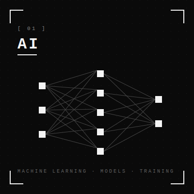
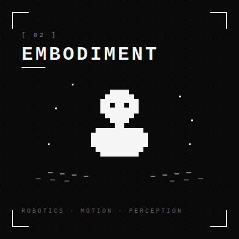
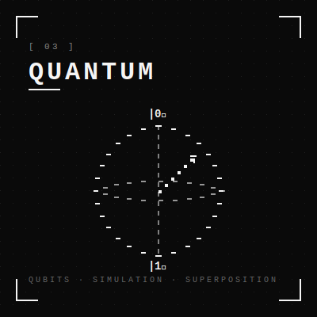
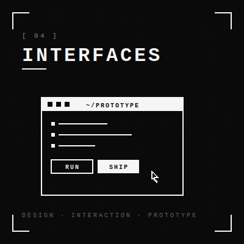

  

  <code>[</code>
  <a href="https://www.jhonglee.com">website</a>
  <code>·</code>
  <a href="https://www.linkedin.com/in/hong-lee-0821">linkedin</a>
  <code>·</code>
  <a href="https://github.com/digitaldna01?tab=repositories">projects</a>
  <code>]</code>

 

<h2 align="center"><code>───────  PROJECTS  ───────</code></h2>

  Four threads. Each repo is a question I'm still trying to answer through code.

 

<!-- ═══════════════════════════ NEURAL ═══════════════════════════ -->

<table align="center" border="0" width="92%" cellpadding="0" cellspacing="0">
  <tr>
    <td width="110" align="center" valign="middle">
      
    </td>
    <td valign="middle" style="padding-left:16px">
      <h3><code>── NEURAL ───────────────────────────────────────</code></h3>
      
Machine learning, large language models, and computer vision.

    </td>
  </tr>
</table>

<table align="center" width="92%">
  <tr>
    <td width="33%" valign="top">
      
<code>[ 01 ]</code>

      <h3><a href="https://github.com/digitaldna01/inflearn-langgraph">LANGGRAPH</a></h3>
      
Agentic LLM workflows — RAG, self-RAG, and corrective RAG patterns built with LangGraph.

      
<code>PYTHON · LANGGRAPH · RAG</code>

    </td>
    <td width="33%" valign="top">
      
<code>[ 02 ]</code>

      <h3><a href="https://github.com/digitaldna01/vit-oxfordPetDataset">VIT · OXFORD PETS</a></h3>
      
Vision Transformer applied to the Oxford Pet Dataset for fine-grained image classification.

      
<code>PYTHON · ViT · TRANSFORMERS</code>

    </td>
    <td width="33%" valign="top">
      
<code>[ 03 ]</code>

      <h3><a href="https://github.com/digitaldna01/catsanddogs">CATS & DOGS</a></h3>
      
Binary image classifier — a clean train/test pipeline exploring baseline CNN performance.

      
<code>PYTHON · CNN · VISION</code>

    </td>
  </tr>
</table>

 

<!-- ═══════════════════════════ EMBODIMENT ═══════════════════════════ -->

<table align="center" border="0" width="92%" cellpadding="0" cellspacing="0">
  <tr>
    <td width="110" align="center" valign="middle">
      
    </td>
    <td valign="middle" style="padding-left:16px">
      <h3><code>── EMBODIMENT ───────────────────────────────────</code></h3>
      
Hand pose estimation, 3D avatar reconstruction, and body sensing.

    </td>
  </tr>
</table>

<table align="center" width="92%">
  <tr>
    <td width="50%" valign="top">
      
<code>[ 01 ]</code>

      <h3><a href="https://github.com/digitaldna01/Handpose">HANDPOSE</a></h3>
      
Hand pose estimation with XGBoost on Unity-generated synthetic data — model interpretation focused.

      
<code>ML · XGBOOST · UNITY</code>

    </td>
    <td width="50%" valign="top">
      
<code>[ 02 ]</code>

      <h3><a href="https://github.com/digitaldna01/cs585-finalproject">3D AVATAR · HEAD TRACKING</a></h3>
      
Research on photorealistic head avatar reconstruction — Gaussian blendshapes, FLAME, MANO, and egocentric hand tracking.

      
<code>RESEARCH · 3DMM · GAUSSIAN</code>

    </td>
  </tr>
</table>

 

<!-- ═══════════════════════════ QUANTUM ═══════════════════════════ -->

<table align="center" border="0" width="92%" cellpadding="0" cellspacing="0">
  <tr>
    <td width="110" align="center" valign="middle">
      
    </td>
    <td valign="middle" style="padding-left:16px">
      <h3><code>── QUANTUM ──────────────────────────────────────</code></h3>
      
Quantum circuit simulation and state-vector exploration.

    </td>
  </tr>
</table>

<table align="center" width="92%">
  <tr>
    <td width="50%" valign="top">
      
<code>[ 01 ]</code>

      <h3><a href="https://github.com/digitaldna01/quantum-simulator">QUANTUM SIMULATOR</a></h3>
      
State-vector, Qiskit, and tensor-network approaches to quantum circuit simulation.

      
<code>PYTHON · QISKIT · RESEARCH</code>

    </td>
    <td width="50%"></td>
  </tr>
</table>

 

<!-- ═══════════════════════════ INTERFACES ═══════════════════════════ -->

<table align="center" border="0" width="92%" cellpadding="0" cellspacing="0">
  <tr>
    <td width="110" align="center" valign="middle">
      
    </td>
    <td valign="middle" style="padding-left:16px">
      <h3><code>── INTERFACES ───────────────────────────────────</code></h3>
      
Human-centered tools that cross the gap between software and the physical world.

    </td>
  </tr>
</table>

<table align="center" width="92%">
  <tr>
    <td width="50%" valign="top">
      
<code>[ 01 ]</code>

      <h3><a href="https://github.com/digitaldna01/bostonhack23">BOSTONHACK23</a></h3>
      
Accessibility-focused navigation prototype using Google Maps for safer mobility for people with disabilities.

      
<code>MAPS API · A11Y · PROTOTYPE</code>

    </td>
    <td width="50%"></td>
  </tr>
</table>

 

<h2 align="center"><code>───────  BACKGROUND  ───────</code></h2>

  <code>[ EDU      ·  Boston University  ·  Computer Science ]</code> 
  <code>[ LOC      ·  Boston, MA                            ]</code> 
  <code>[ THINKING ·  experimentation  →  systems  →  use   ]</code>

 

<h2 align="center"><code>───────  GITHUB SNAPSHOT  ───────</code></h2>

  
  
    
  

  <code>&gt; end of file_</code>

