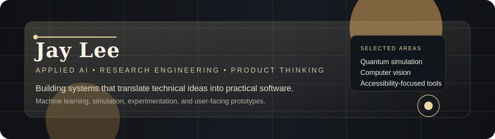

  

  <a href="https://www.jhonglee.com">Website</a> ·
  <a href="https://www.linkedin.com/in/hong-lee-0821">LinkedIn</a> ·
  <a href="https://github.com/digitaldna01?tab=repositories">Projects</a>

  I work across applied AI, research engineering, and product-oriented software.
   
  My focus is building systems that connect technical depth with practical use.

## Overview

I am most interested in work that lives between experimentation and delivery: training models, validating ideas, and shaping them into tools that people can actually use.

<table>
  <tr>
    <td width="50%" valign="top">
      <h3>What I Work On</h3>
      

        • Applied machine learning and data systems 
        • Research-oriented engineering and simulation 
        • Prototyping interfaces for technical products 
        • Turning complex concepts into usable software
      

    </td>
    <td width="50%" valign="top">
      <h3>How I Like To Build</h3>
      

        • Start from the underlying technical question 
        • Build with clarity before adding complexity 
        • Balance analytical rigor with usability 
        • Treat implementation as part of the research process
      

    </td>
  </tr>
</table>

## Selected Work

<table>
  <tr>
    <td width="33%" valign="top">
      <h3><a href="https://github.com/digitaldna01/quantum-simulator">Quantum Simulator</a></h3>
      

        A research-driven project exploring state-vector, Qiskit, and tensor-network approaches to quantum simulation.
      

    </td>
    <td width="33%" valign="top">
      <h3><a href="https://github.com/digitaldna01/Handpose">Handpose</a></h3>
      

        Hand pose estimation with XGBoost and Unity-generated data, focused on experimentation and model interpretation.
      

    </td>
    <td width="33%" valign="top">
      <h3><a href="https://github.com/digitaldna01/bostonhack23">BostonHack23</a></h3>
      

        An accessibility-focused navigation prototype using the Google Maps API for safer, more independent mobility.
      

    </td>
  </tr>
</table>

## Current Direction

I am especially drawn to projects where machine learning, simulation, and software design meet practical constraints.
That usually means building prototypes, testing assumptions quickly, and refining systems until they are both technically sound and usable.

## Background

- Boston University, Computer Science
- Based in Boston, MA
- Interested in AI systems, computational modeling, and product design

## GitHub Snapshot

  
  

